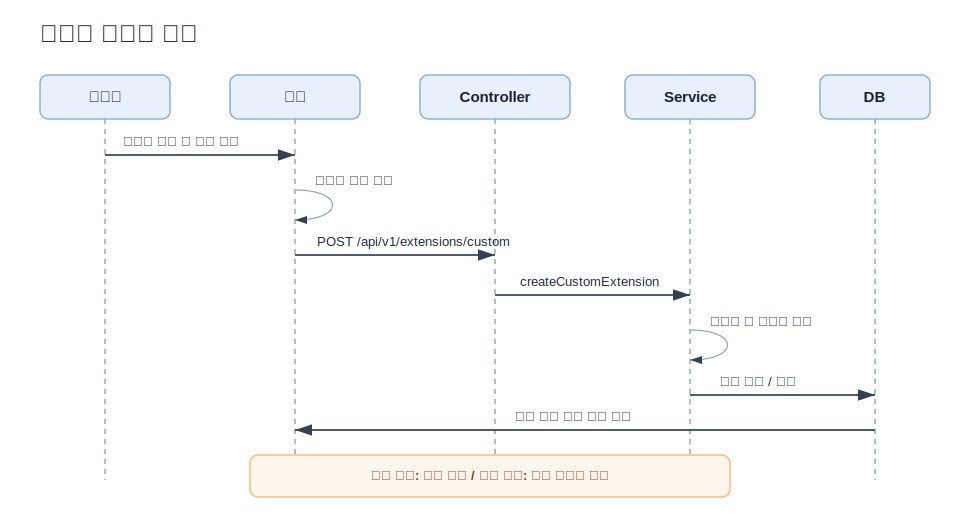
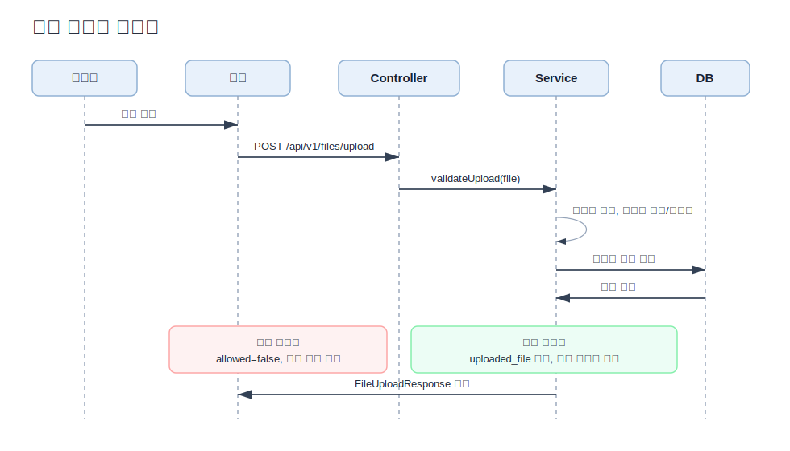
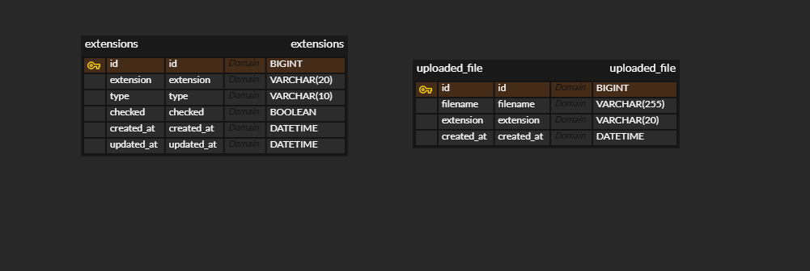

# 파일 확장자 차단 관리
파일 확장자 차단 과제 제출자-김종수
---

어떤 파일들은 첨부시 보안에 문제가 될 수 있습니다. 특히 exe, sh 등의 실행파일이 존재할 경우 서버에 올려서 실행이 될 수 있는 위험이 있어 파일 확장자 차단을 하게되었습니다.

## 과제 요구사항

1-1. 고정 확장자는 차단을 자주하는 확장자를 리스트이며, default는 unCheck되어져 있습니다.

1-2. 고정 확장자를 check or uncheck를 할 경우 db에 저장됩니다. 새로고침시 유지되어야합니다. 아래쪽 커스텀 확장자에는 표현되지 않으니 유의해주세요.

2-1. 확장자 최대 입력 길이는 20자리

2-2. 추가버튼 클릭시 db 저장되며, 아래쪽 영역에 표현됩니다.

3-1. 커스텀 확장자는 최대 200개까지 추가가 가능

3-2. 확장자 옆 X를 클릭시 db에서 삭제

## 추가 고려사항

사용자 입력은 항상 의도치 않은 형태로 들어온다. 이를 전제로, 서버가 방어적으로 처리해야 한다.

### 1. 대소문자 통합

문제 인식: EXE, Exe, exe는 운영체제 입장에서 동일한 확장자지만, 단순 문자열 비교 시 다르게 취급될 수 있다.

결정: 저장 전 소문자로 정규화하여 확장자의 동일성을 보장한다.

### 2. UNIQUE 제약 조건

문제 인식: 애플리케이션 레벨에서만 중복을 검증하면 동시 요청 등 레이스 컨디션 상황에서 중복 삽입이 발생할 수 있다.

결정: DB 레벨에 UNIQUE 제약을 두어 중복을 원천 차단한다. 애플리케이션 검증과 DB 제약을 이중으로 두어 방어한다.

### 3. trim 처리

문제 인식: 사용자가 " exe " 처럼 공백을 포함해 입력할 경우, 실제로는 동일한 확장자임에도 다른 값으로 저장될 수 있다.

결정: 저장 전 앞뒤 공백을 제거하여 의도치 않은 데이터를 방지한다.

### 4. 점(.) 제거

문제 인식: .exe와 exe는 사용자 입장에서 같은 의미지만 문자열로는 다르다. UI에서 어떤 형식으로 입력하든 동일하게 처리되어야 한다.

결정: 확장자에서는 문자열이 중요하므로 서버에서는 입력값의 맨 앞 점을 제거한 뒤 저장한다.

### 5. 빈 값 차단

문제 인식: 빈 문자열이나 공백만 존재하는 값은 확장자로서 의미가 없으며, DB에 쓰레기 데이터가 쌓이는 원인이 된다.

결정: 프론트에서는 빈값은 보내지못하게 하며,서버에서는 trim 이후에도 빈 문자열인 경우 유효하지 않은 입력으로 판단하고 예외 처리한다.

### 6. 고정 확장자 ↔ 커스텀 확장자 중복 방지

문제 인식: 두 테이블이 분리되어 있으면 각각의 UNIQUE 제약만으로는 테이블 간 중복을 막을 수 없다. exe가 고정 확장자에 이미 있는데 커스텀으로도 추가되면 차단 로직이 혼란스러워진다.

결정: 커스텀 확장자 추가 시 고정 확장자 목록과 교차 검증하는 로직을 서비스 레이어에 명시적으로 추가한다.

### 7. 파일명 형태 입력 차단 (example.zip)

문제 인식: 사용자가 확장자가 아닌 파일명 전체를 입력하는 실수를 할 수 있다. 이 경우 example.zip 자체가 확장자로 등록되어 차단 기능이 무의미해진다.

결정: 입력값에 점(.)이 포함된 경우 유효하지 않은 입력으로 판단한다. 확장자에는 점이 포함될 수 없다.

### 8. 고정확장자는 클라이언트의 요구에 따라 언제든지 바뀔수 있다.

문제 인식: 클라이언트와 제공자가 생각하는 고정확장자가 달라질 수 있으며, 변경될 수도있다.

결정: 고정확장자를 컬럼으로 고정하지 않고 DB 데이터로 저장하여 추가/삭제가 쉽게 가능하도록 한다.

## 시퀀스 다이어그램

### 커스텀 확장자 추가

### 파일 업로드 테스트

## ERD 다이어그램

